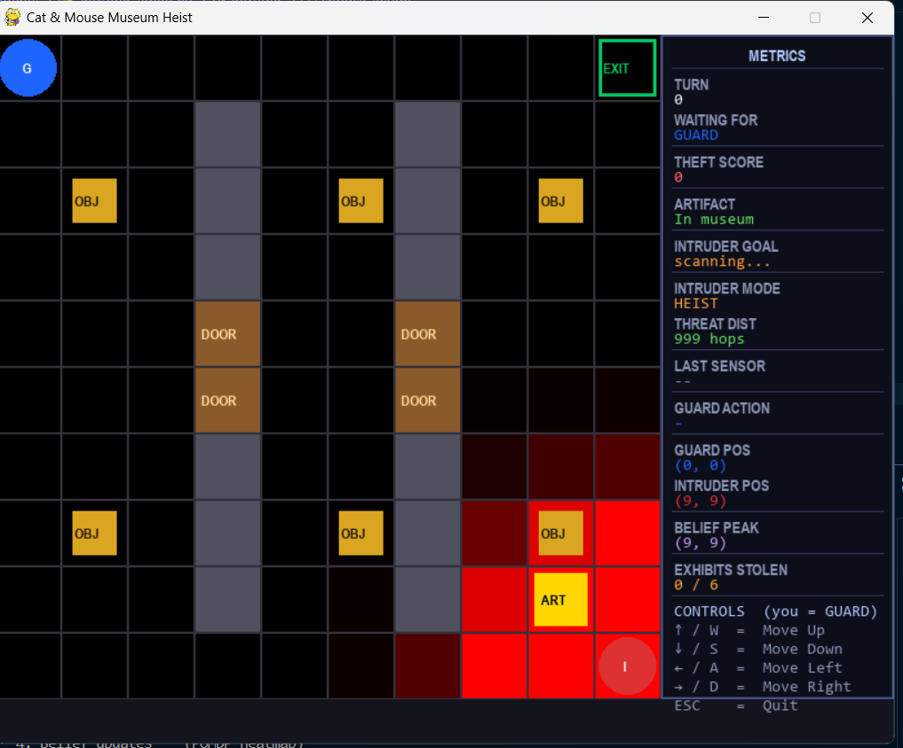

# 🏛️ The Cat & Mouse Museum Heist

### Pursuit-Evasion Simulation · POMDP + BFS AI · Pygame

> **You are the Guard.** An AI intruder is loose in the museum.  
> Catch it before it steals the artifact and vanishes — but it _knows_ you're coming.

---



## 📋 Table of Contents

- [Overview](#overview)
- [Quick Start](#quick-start)
- [How to Play](#how-to-play)
- [Game World](#game-world)
- [AI Behaviour](#ai-behaviour)
- [POMDP Belief System](#pomdp-belief-system)
- [Scoring](#scoring)
- [Project Structure](#project-structure)
- [Module Reference](#module-reference)
- [Architecture Diagram](#architecture-diagram)
- [Dependencies](#dependencies)

---

## Overview

This is a **turn-based pursuit-evasion game** built on a 10×10 grid museum.  
It combines classical AI search (BFS pathfinding) with probabilistic reasoning (POMDP belief updates) to simulate a realistic cat-and-mouse scenario.

| Agent           | Controller                  | Strategy                                 |
| --------------- | --------------------------- | ---------------------------------------- |
| 🔵 **Guard**    | **You** (keyboard)          | Chase the intruder using sensor readings |
| 🔴 **Intruder** | **AI** (BFS + threat model) | Steal, survive, escape                   |

---

## Quick Start

```bash
# 1. Install dependencies
pip install -r requirements.txt

# 2. Run the game
python main.py
```

> **Python 3.8+** required.

---

## How to Play

### Controls

| Key        | Action           |
| ---------- | ---------------- |
| `↑` or `W` | Move Guard Up    |
| `↓` or `S` | Move Guard Down  |
| `←` or `A` | Move Guard Left  |
| `→` or `D` | Move Guard Right |
| `ESC`      | Quit             |

### Turn Sequence

Each keypress triggers **one complete turn** in this exact order:

```
┌─────────────────────────────────────────────┐
│  1. GUARD moves         ← your keypress     │
│  2. INTRUDER AI moves   ← BFS + threat eval │
│  3. SENSOR fires        ← noisy detection   │
│  4. BELIEF updates      ← POMDP heatmap     │
└─────────────────────────────────────────────┘
```

### Win / Lose Conditions

| Outcome                        | Condition                              | Console message                          |
| ------------------------------ | -------------------------------------- | ---------------------------------------- |
| 🏆 **Guard wins**              | Guard steps onto intruder's cell       | `Guard CAUGHT the intruder!`             |
| 💀 **Intruder escapes (full)** | Intruder reaches EXIT with artifact    | `Intruder ESCAPED with the artifact!`    |
| 🚪 **Intruder survives**       | Intruder reaches EXIT without artifact | `Intruder ESCAPED safely (no artifact)!` |

---

## Game World

### Grid Layout (10 × 10)

```
  0   1   2   3   4   5   6   7   8   9
0 [G] [ ] [ ] [ ] [ ] [ ] [ ] [ ] [ ] [X]   ← G=Guard start, X=Exit
1 [ ] [ ] [ ] [█] [ ] [ ] [█] [ ] [ ] [ ]
2 [ ] [o] [ ] [█] [ ] [o] [█] [ ] [o] [ ]   ← o=Museum exhibit
3 [ ] [ ] [ ] [█] [ ] [ ] [█] [ ] [ ] [ ]
4 [ ] [ ] [ ] [D] [ ] [ ] [D] [ ] [ ] [ ]   ← D=Door (passable gap)
5 [ ] [ ] [ ] [D] [ ] [ ] [D] [ ] [ ] [ ]
6 [ ] [ ] [ ] [█] [ ] [ ] [█] [ ] [ ] [ ]
7 [ ] [o] [ ] [█] [ ] [o] [█] [ ] [o] [ ]
8 [ ] [ ] [ ] [█] [ ] [ ] [█] [ ] [★] [ ]   ← ★=Artifact
9 [ ] [ ] [ ] [█] [ ] [ ] [█] [ ] [ ] [I]   ← I=Intruder start
```

### Legend

| Symbol   | Meaning                                                                  |
| -------- | ------------------------------------------------------------------------ |
| 🔵 `G`   | Guard (you) — starts at `(0,0)`                                          |
| 🔴 `I`   | Intruder (AI) — starts at `(9,9)`                                        |
| `█`      | **Wall** — impassable                                                    |
| `D`      | **Door** — passable gap in walls (rows 4–5, cols 3 & 6)                  |
| `o`      | **Exhibit object** — +10 pts if intruder collects                        |
| `★`      | **Artifact** — +50 pts if intruder steals                                |
| `X`      | **Exit** — intruder escapes here                                         |
| Red heat | **POMDP belief map** — brighter = guard thinks intruder more likely here |

---

## AI Behaviour

The intruder AI operates in **4 reactive modes**, switching each turn based on real BFS distance from the guard:

```
                     ┌──────────────────────────────┐
                     │    Compute guard BFS dist    │
                     └──────────────┬───────────────┘
                                    │
              ┌─────────────────────▼──────────────────────┐
              │         threat_dist ≤ 4  (DANGER)?         │
              └──────┬──────────────────────────┬──────────┘
                    YES                         NO
                     │                           │
        ┌────────────▼──────────┐    ┌───────────▼───────────┐
        │  Has artifact?        │    │   Has artifact?       │
        └──┬───────────────┬────┘    └──┬────────────────┬───┘
          YES              NO          YES               NO
           │               │            │                │
    ┌──────▼──────┐  ┌──────▼──────┐ ┌──▼──────┐  ┌──────▼──────────┐
    │ FLEE→EXIT   │  │    FLEE     │ │ ESCAPE  │  │     HEIST       │
    │ (safe path  │  │ (maximise   │ │ (BFS to │  │ (BFS to nearest │
    │  to exit)   │  │  guard dist)│ │  exit)  │  │  safe exhibit / │
    └─────────────┘  └─────────────┘ └─────────┘  │  then artifact) │
                                                   └─────────────────┘
```

### Mode Details

<details>
<summary><strong>🔴 FLEE</strong> — Guard too close, no artifact</summary>

Scores each neighbour cell by its BFS distance from the guard.  
Picks the move that **maximises distance** — pure survival.

</details>

<details>
<summary><strong>🟠 FLEE→EXIT</strong> — Guard too close, has artifact</summary>

Combines safety and progress:  
`score = guard_dist × 10 − exit_dist`  
Runs away AND steers toward the exit simultaneously.

</details>

<details>
<summary><strong>🟡 HEIST</strong> — Safe distance, no artifact yet</summary>

1. Looks for any exhibit reachable in ≤ 4 BFS steps **and** whose cell is also outside danger radius
2. If found → BFS to that exhibit
3. If no safe exhibit → BFS directly to the artifact

</details>

<details>
<summary><strong>🟢 ESCAPE</strong> — Safe distance, artifact stolen</summary>

Pure BFS to the exit. Shortest path through walls and doors.

</details>

> **Key rule:** The intruder can escape without the artifact if cornered. Survival matters more than loot.

---

## POMDP Belief System

The guard's **belief map** is a probability distribution over every cell — it represents where the guard _thinks_ the intruder might be.

### Initialisation

Belief starts as a Gaussian centred on `(9,9)` (intruder's start corner), biased with variance `σ²=4`.

### Update Each Turn (in `pomdp/belief_update.py`)

```
Step 1 — DIFFUSE
  Spread 12% of each cell's probability to its 4 neighbours
  (models intruder possibly moving one step)

Step 2 — SENSOR UPDATE
  ┌─────────────────────────────────────────┐
  │ If DETECTED (motion sensor triggered):  │
  │   • Spike within radius 2 around guard  │
  │     e.g. guard cell × 13, falls off     │
  │     as e^(-dist²/1.5)                   │
  │   • Zero-out cells > 4 hops away        │
  │     (intruder can't be far if detected) │
  │                                         │
  │ If NOT DETECTED:                        │
  │   • Decay cells near guard              │
  │     weight = 1 - dist/(radius+1)        │
  │     cell × max(0.10, 1 − 0.65×weight)   │
  └─────────────────────────────────────────┘

Step 3 — NORMALISE + NOISE FLOOR
  Add 0.001 uniform mass (no cell ever reaches zero)
  Re-normalise so all probabilities sum to 1
```

### Sensor Noise Model (`env/sensors.py`)

| Situation             | Probability | Result                           |
| --------------------- | ----------- | -------------------------------- |
| Guard on intruder     | 80%         | Returns `True` (detected)        |
| Guard on intruder     | 20%         | Returns `False` (false negative) |
| Guard not on intruder | 10%         | Returns `True` (false positive)  |
| Guard not on intruder | 90%         | Returns `False` (correct clear)  |

The red heatmap on the grid **visualises this belief** in real-time — brighter red = higher belief.

---

## Scoring

### Intruder's Theft Score (shown in panel)

| Event                              | Points |
| ---------------------------------- | ------ |
| Collect a museum exhibit           | +10    |
| Steal the artifact                 | +50    |
| Escape with artifact               | +100   |
| Escape without artifact (survival) | +20    |

> **Guard goal:** keep the theft score at zero by catching the intruder.

---

## Project Structure

```
📁 The Cat and Mouse Museum Heist/
│
├── main.py                    ← Game loop, turn logic, event handling
├── config.py                  ← (Reserved for tunable constants)
├── requirements.txt
├── README.md
│
├── 📁 env/
│   ├── grid_world.py          ← GridWorld: walls, doors, objects, move()
│   └── sensors.py             ← MotionSensor: noisy binary detection
│
├── 📁 agents/
│   ├── guard_agent.py         ← Guard: BFS pathfinder to belief peak
│   └── intruder_agent.py      ← Intruder: 4-mode threat-aware BFS AI
│
├── 📁 pomdp/
│   ├── belief_update.py       ← Belief: POMDP map, diffuse, sensor update
│   └── ipomdp_model.py        ← (Reserved for I-POMDP extension)
│
└── 📁 visualization/
    └── viewer.py              ← Pygame renderer + side-panel metrics
```

---

## Module Reference

<details>
<summary><strong>env/grid_world.py — GridWorld</strong></summary>

```python
GridWorld(size=10)
```

| Attribute  | Type    | Description                            |
| ---------- | ------- | -------------------------------------- |
| `walls`    | `set`   | Impassable cells `{(row, col), ...}`   |
| `doors`    | `set`   | Passable wall gaps                     |
| `objects`  | `list`  | Remaining exhibit positions            |
| `artifact` | `tuple` | Fixed at `(8, 8)`                      |
| `exit`     | `tuple` | Fixed at `(0, 9)`                      |
| `guard`    | `list`  | Current guard position `[row, col]`    |
| `intruder` | `list`  | Current intruder position `[row, col]` |

```python
env.move(pos, action)   # → new [row, col], wall-blocked
env.reset()             # → resets guard to (0,0), intruder to (9,9)
```

</details>

<details>
<summary><strong>env/sensors.py — MotionSensor</strong></summary>

```python
MotionSensor(fp=0.1, fn=0.2)
# fp = false positive rate (detects when not present)
# fn = false negative rate (misses when present)

sensor.detect(guard_pos, intruder_pos)  # → bool
```

</details>

<details>
<summary><strong>pomdp/belief_update.py — Belief</strong></summary>

```python
Belief(size)

belief.update(observation: bool, guard_pos: list)
# Diffuses + applies sensor likelihood + normalises

belief.most_likely(exclude=None)  # → [row, col] of highest-prob cell
belief.map                        # → np.ndarray (size×size), sums to 1
```

</details>

<details>
<summary><strong>agents/guard_agent.py — Guard</strong></summary>

```python
Guard(belief)

guard.choose_action(guard_pos, env)
# → "UP"|"DOWN"|"LEFT"|"RIGHT"
# BFS from guard to belief.most_likely() — guaranteed shortest path
```

> Note: Guard is not used in main.py (you control the guard).  
> Available for bot vs bot / autopilot testing.

</details>

<details>
<summary><strong>agents/intruder_agent.py — Intruder</strong></summary>

```python
Intruder()

intruder.choose_action(intruder_pos, env, artifact_collected)
# → (action, goal_desc, mode, threat_dist)
# mode: "HEIST" | "FLEE" | "FLEE→EXIT" | "ESCAPE"
# threat_dist: BFS hops from guard to intruder
```

</details>

<details>
<summary><strong>visualization/viewer.py — Viewer</strong></summary>

```python
Viewer(size)

viewer.draw(env, belief,
            theft_score, artifact_collected,
            turn, whose_turn,
            last_obs, last_guard_action,
            intruder_goal, intruder_mode, threat_dist)
```

Window: `(size × 60 + 210) × max(size × 60, 640)` px  
Side panel shows 10 live metrics updated every frame.

</details>

---

## Architecture Diagram

```
┌──────────────────────────────────────────────────────────┐
│                        main.py                           │
│                                                          │
│  key press                                               │
│     │                                                    │
│     ▼                                                    │
│  1. env.move(guard, action)          ← GridWorld         │
│     │                                                    │
│  2. intruder.choose_action(...)      ← Intruder AI       │
│     │   ├── _dist_map(guard)  BFS                        │
│     │   ├── threat check (≤4 hops?)                      │
│     │   └── select mode: FLEE/HEIST/ESCAPE               │
│     │                                                    │
│  3. sensor.detect(guard, intruder)   ← MotionSensor      │
│     │   └── noisy binary (fp=0.1, fn=0.2)                │
│     │                                                    │
│  4. belief.update(obs, guard_pos)    ← Belief (POMDP)    │
│     │   ├── diffuse (spread 12%)                         │
│     │   ├── spike/decay near guard                       │
│     │   └── normalise + noise floor                      │
│     │                                                    │
│  5. viewer.draw(...)                 ← Pygame            │
│         ├── grid heatmap (belief.map)                    │
│         ├── walls, doors, objects, artifact, exit        │
│         ├── guard 🔵  intruder 🔴                        │
│         └── side panel (10 live metrics)                 │
└──────────────────────────────────────────────────────────┘
```

---

## Dependencies

```
numpy       — belief map array operations
pygame      — real-time grid visualisation
matplotlib  — (available for offline belief plotting)
gymnasium   — (available for RL extension)
pomdp-py    — (available for full POMDP solver integration)
```

Install all:

```bash
pip install -r requirements.txt
```

---

## Tips & Strategy

> - **Watch the red heatmap** — it shows where your POMDP sensor thinks the intruder is. Chase the brightest cell.
> - **Block the doors** at rows 4–5 (cols 3 and 6) — they are the only passages through the wall barriers.
> - **The intruder flees when you are within 4 cells.** Use wide flanking moves rather than direct charges.
> - **Pressure the artifact `(8,8)` early** — if the intruder steals it, it will immediately try to flee to exit `(0,9)`.
> - **Sensor alerts (DETECTED)** spike the belief near you. Use these to narrow your search.

---

_CDAC Internship Project · Pursuit-Evasion Simulation · 2026_
